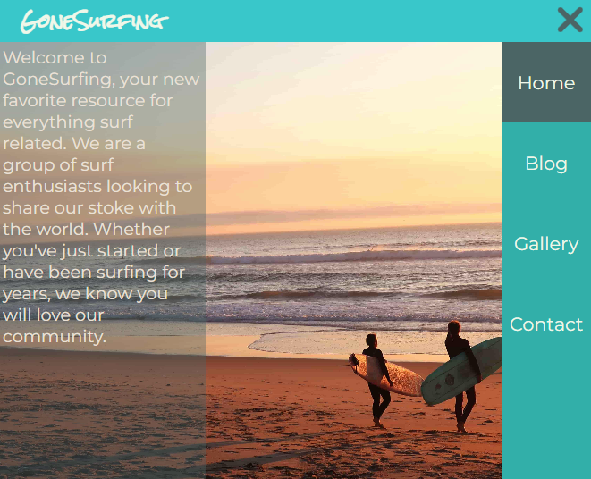
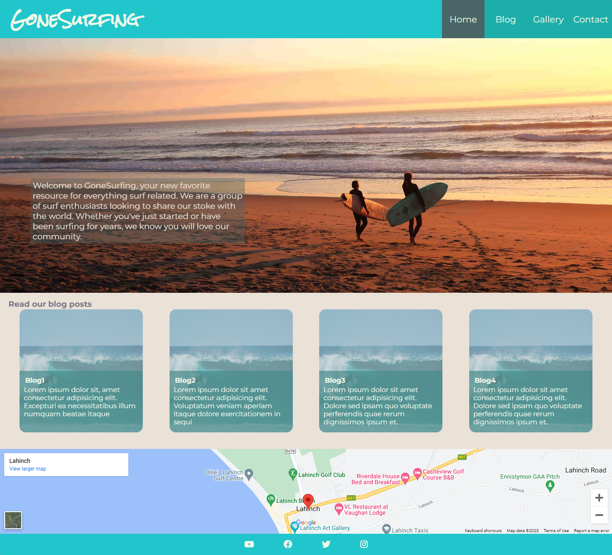
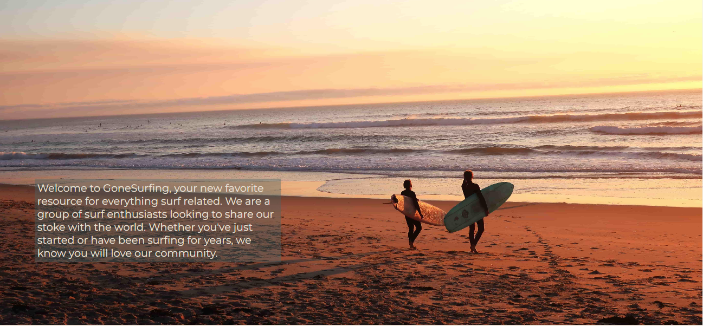
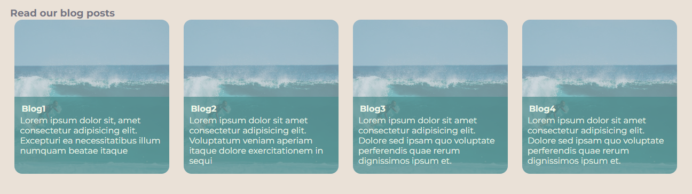
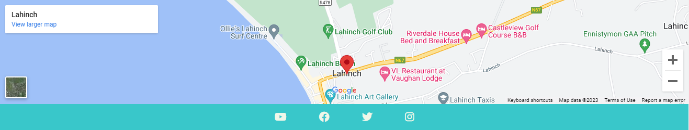
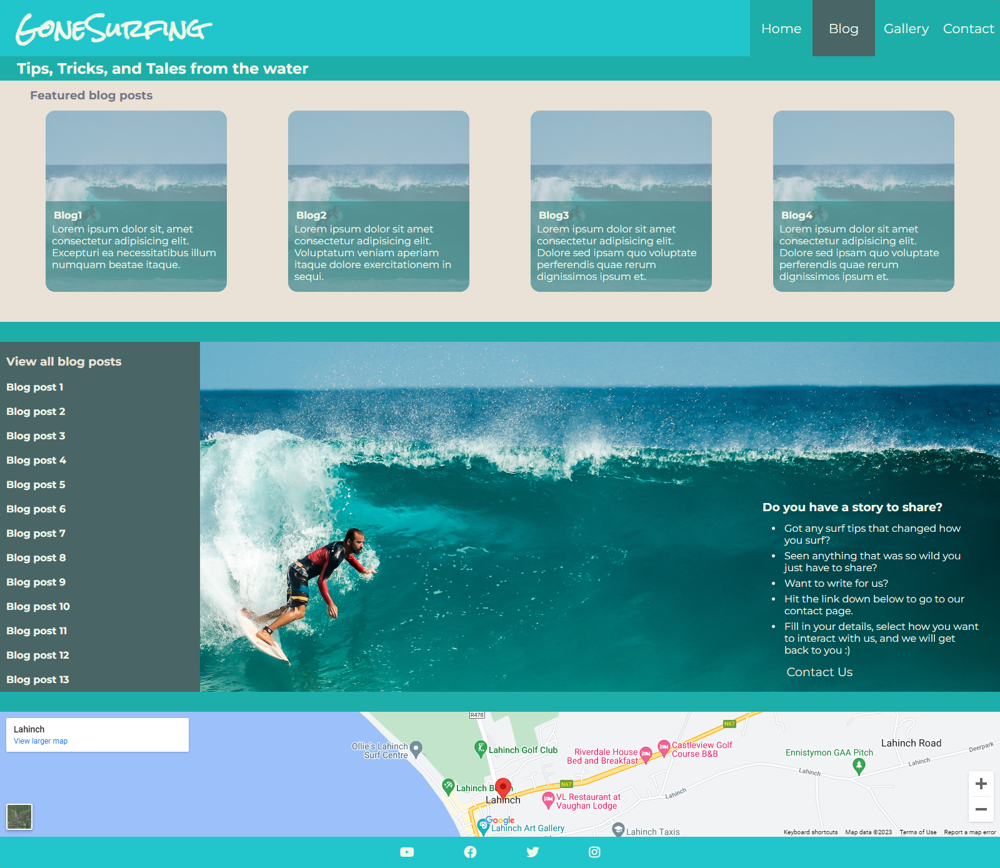
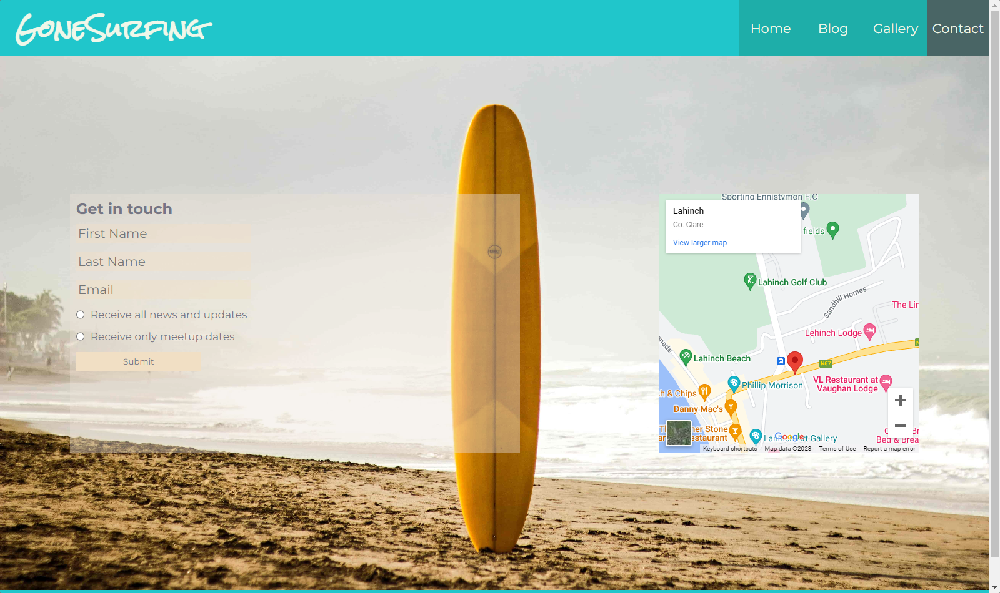
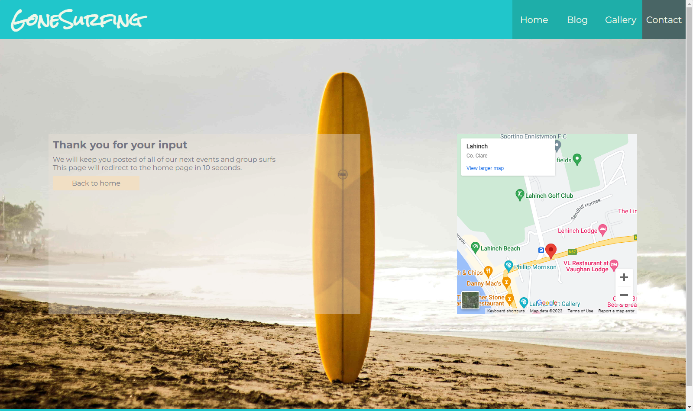

# GoneSurfing

The site can be accessed through this [link](https://robinf98.github.io/gone-surfing/)

## User Stories

---

### First Time User Goals

* As a First Time User, I want to learn more about surfing, so that I can get more involved in the activity.
* As a First Time User, I want to understand the purpose of the site, so that I can use it more effectively.
* As a First Time User, I want to get tips on how to get started with surfing.
* As a First Time User, I want to be find contact details for the GoneSurfing team, so that I can ask questions and get involved.

### Returning User Goals

* As a Returning User, I want to be able to find out where the GoneSurfing team meet and surf, so that I can join them.
* As a Returning User, I want to see pictures of the GoneSurfing team surfing, so that I can get a better feel for the team ethos.

### Frequent User Goals

* As a Frequent User, I want to recieve regular updates on the GoneSurfing community, so that I can stay informed and incorporate surfing further into my lifestyle.
* As a Frequent User, I want to use GoneSurfing as my primary source of surfing news.
* As a Frequent User, I want to see updated pictures of GoneSurfing Meetups, so that I can see myself surfing.

## Features

---

### Navbar

* Positioned at page top.
* Logo on left side.
* Navigation links on right side.
  * HOME - links to home page where users can see an overview of theGoneSurfing site.
  * BLOG - links to the blog page where users can read articles andlearn more about surfing.
  * GALLERY - links to gallery page where users can see pictures ofcommunity members surfing.
  * CONTACT - links to contact page where users can join a mailing list and get in touch.
* All links have a hover effect animation.

* The navbar is responsive:
  * On smaller screens (<800px wide), the navbar is replaced by a hamburger menu with a sidebar for navigation.

* When the hamburger meunu is clicked, the sidebar with navigation links pops out.
* These links have hover effect animations.

### Home Page

* Provides:
  * An overview of what GoneSurfing is.
  * Featured blog posts to read through.
  * Google maps section showing location of meetups.
* The home page is responsive - elements will rearrange and resize themselves to suit smaller screens.

#### Hero Section

* Large background image.
* Welcome message to users.

#### Featured Blog Section

* Shows featured blog posts.
* Posts have hover effect animation.

#### Footer

* Contains Google Maps iframe displaying meetup locations.
* Contains social media links that open in a new tab.
* Links have hover animation.

### Blog page

* Provides
  * Featured blogs posts for the user to read.
  * A list of all blog posts.
  * A call to action inviting the user to share their own stories with GoneSurfing, and a contact button linking to the Contact page.
* The featured blog posts have a hover effect animation.
* The list of blog posts has a hover effect animation.
* The blog page is responsive - elements will rearrange and resizethemselves to suit smaller screens.
* The footer is identical to the footer on the home page.

### Gallery Page

* Provides:
  * A hero image, and a gallery of photos of GoneSurfing members.
* Each photo in the gallery has a hover effect zoom animation.
* The Gallery is responsive - elements will rearrange and resize themselves to suit smaller screens.
* The footer is identical to the footer on the home page.

### Contact Page

* Provides:
  * An opportunity for users to join the GoneSurfing Mailing list, and recieve news and updates and dates of future meetups.
  * An iframe of the Google Maps location of GoneSurfing meetups.
* All inputs are required.
* There is a radio button option to recieve all news and updates, oronly meetup dates.
* The submit button has a hover effect animation.
* The Contact page is responsive - elements will rearrange and resizethemselves to suit smaller screens.
* The footer is identical to the footer on the Home page, except it is missing the Google Maps iframe.

### Response Page

* Provides:
  * A page for users to view after hitting submit oin the Contact page.
  * Informs users that they will be kept up to date with GoneSurfing news and events.
  * A button that links back to the Home page.
* The Response page will automatically redirect to home page in 10seconds.
* The Response page is responsive - elements will rearrange and resizethemselves to suit smaller screens.
* The footer is identical to the footer on the Home page, except it is missing the Google Maps iframe.

* ### Features still to implement

  * Search feature for blog posts.
  * Integrated calendar showing meetup dates and times.

## Techologies used

---

* [HTML](https://developer.mozilla.org/en-US/docs/Web/HTML) - was used for the site structure.
* [CSS](https://developer.mozilla.org/en-US/docs/Web/css) - was used to provide styles and layout.
* [CSS Flexbox](https://developer.mozilla.org/en-US/docs/Learn/CSS/CSS_layout/Flexbox) - was used to for layout and responsiveness
* [Balsamiq](https://balsamiq.com/) was used for wireframing.
* [VSCode](https://code.visualstudio.com/) was used  for source-code editing.
* [Git](https://git-scm.com/) was used for version control.
* [GitHub](https://github.com/) was used for hosting.

## Testing

---

Please refer to the [TESTING.md](TESTING.md) file for all testing documentation.

## Deployment

---

* The site was deployed to GitHub pages. The steps to deploy are as follows:
  * Navigate to the Settings tab in the [GoneSurfing Repository](https://github.com/RobinF98/gone-surfing).
  * From the Pages tab, set the Sauce dropdown to "Deploy from a branch".
  * Select the main branch from the Select branch dropdown.
  * Save the changes. The site will be deployed in a few minutes.

## Wireframes

---

### Desktop screen size

[Desktop - Home](documentation/home.png)

[Desktop - Blog](documentation/blog.png)

[Desktop - Gallery](documentation/gallery.png)

[Desktop - Contact](documentation/contact.png)

### Mobile screen size

[Mobile - Home](documentation/home_mobile.png)

[Mobile - Blog](documentation/blog_mobile.png)

[Mobile - Gallery](documentation/gallery_mobile.png)

[Mobile - Contact](documentation/contact_mobile.png)

## BUGS

* Hover effect fro blog post doesent eork in firefox

## Credits

---

### Content

* The Hamburger Menu was based on the CSS only Hamburger Menu from WebDev Simplified - The license for use can be found [here](documentation/LICENSE.txt). The YouTube tutorial can be found [here](https://www.youtube.com/watch?v=dAIVbLrAb_U&ab_channel=WebDevSimplified).
* The icons in the footer were taken from [Font Awesome](https://fontawesome.com/)
* The fonts used in the site were taken from [Google Fonts](https://fonts.google.com/)

### Media

* The images used in the site were taken from [Unsplash](https://unsplash.com/) and [Pexels](https://www.pexels.com/).

## Acknowledgements

* [Juliia Konovalova](https://github.com/IuliiaKonovalova) - My CI mentor, who provided a lot of much needed advice and encouragement. I have learnt a lot from her in a very short space of time, and I am very grateful.
