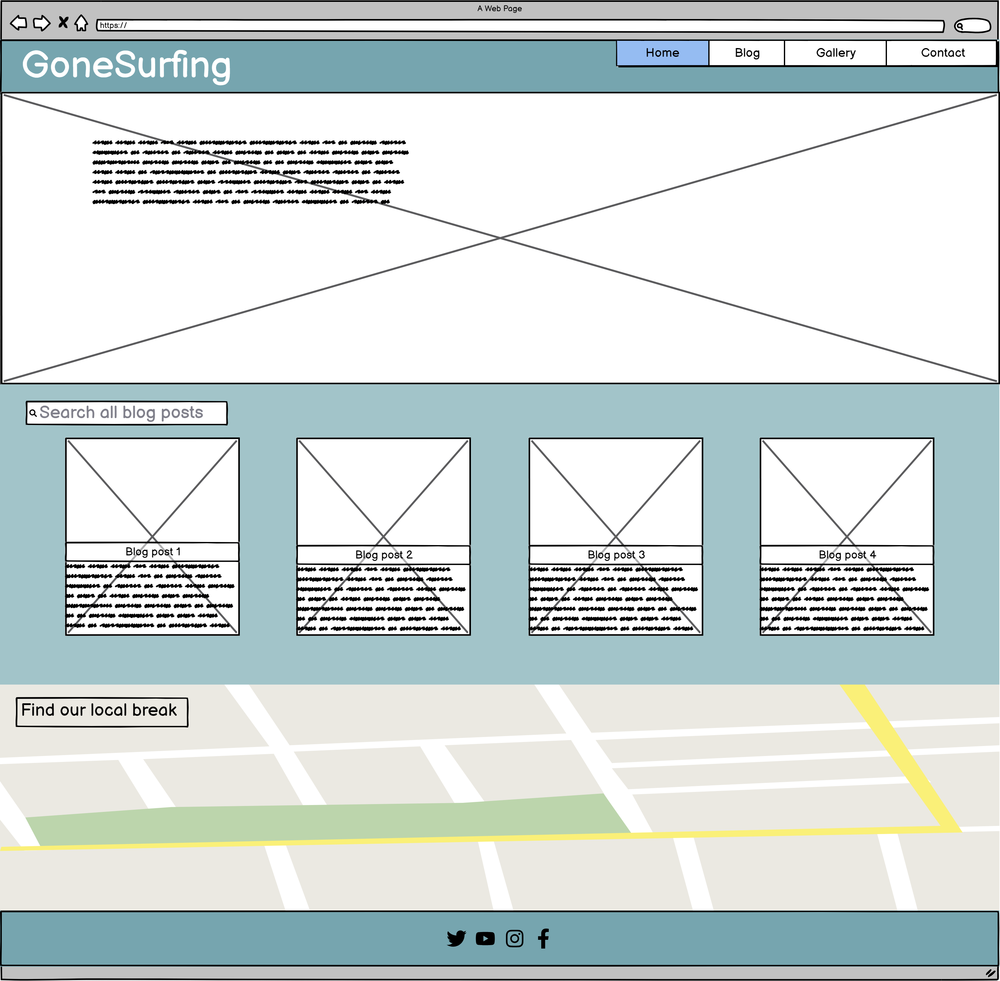
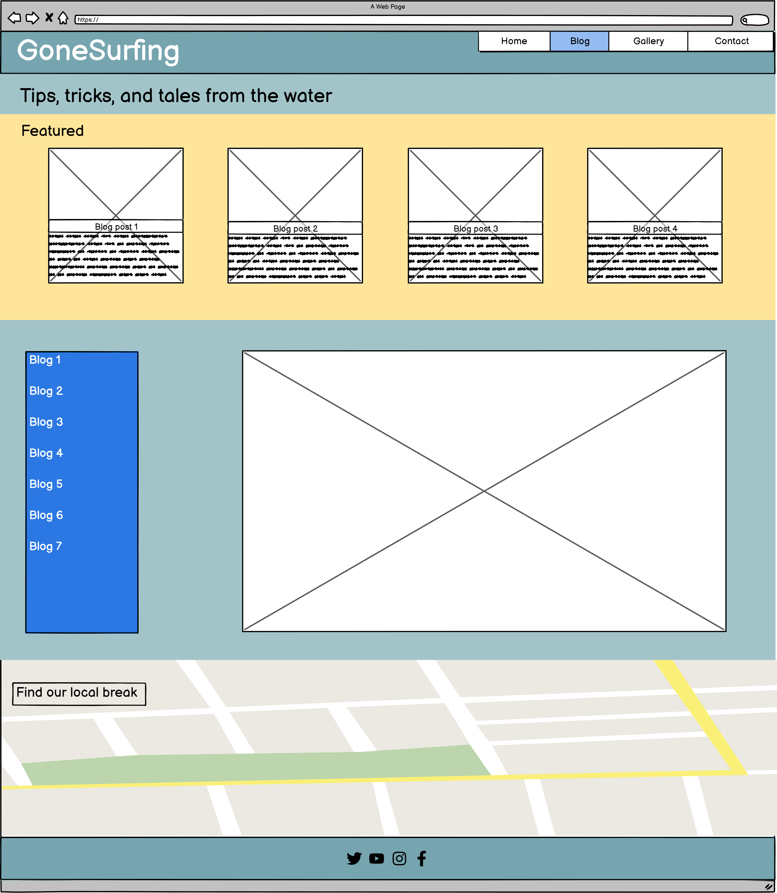
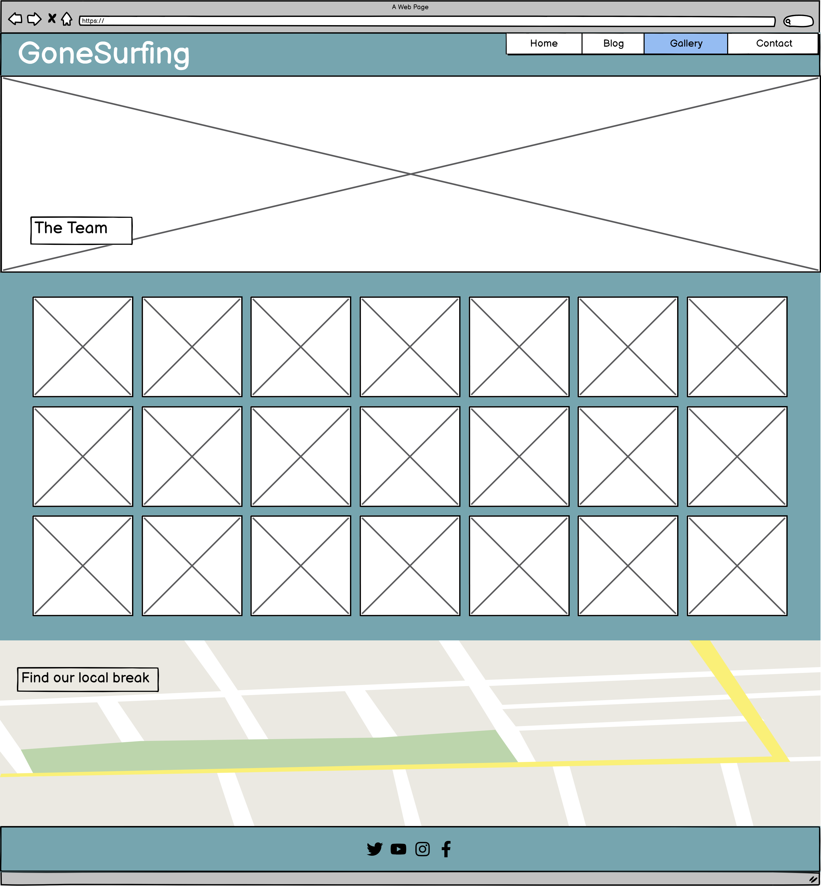
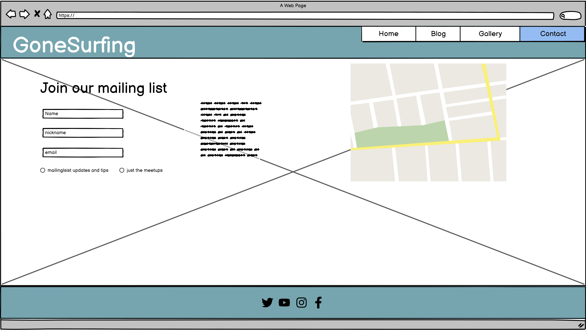
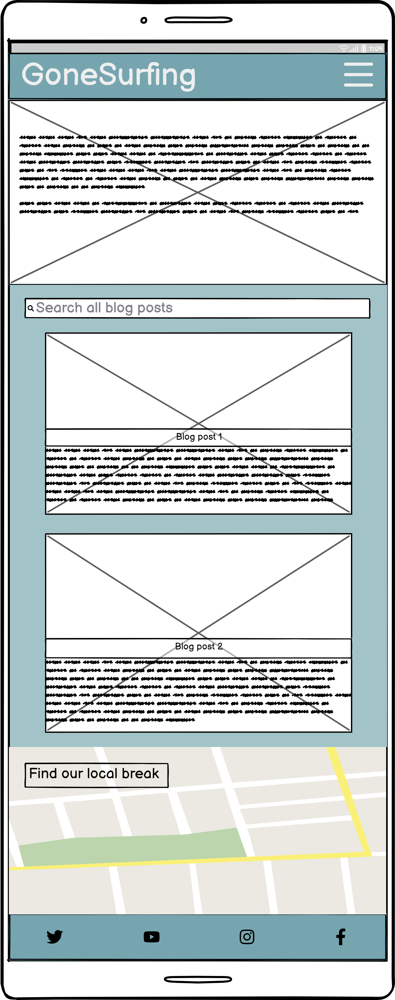
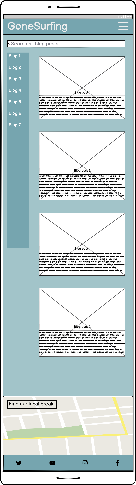
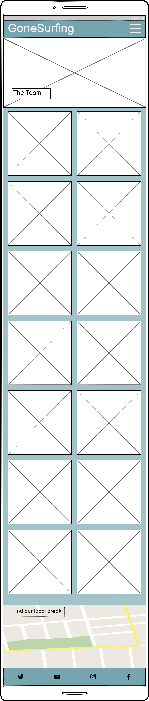
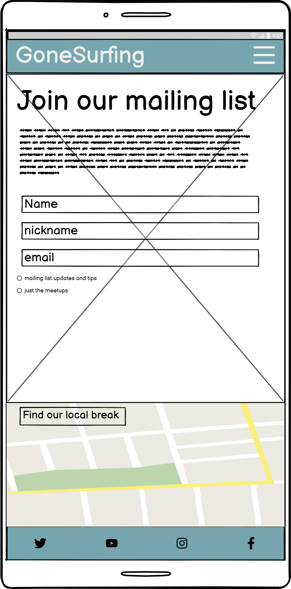

# GoneSurfing

## User Stories

### First Time User Goals
* As a First Time User, I want to learn more about surfing, so that I can get more involved in the activity.
* As a First Time User, I want to understand the purpose of the site, so that I can use it more effectively.
* As a First Time User, I want to get tips on how to get started with surfing.
* As a First Time User, I want to be find contact details for the GoneSurfing team, so that I can ask questions and get involved.
### Returning User Goals
* As a Returning User, I want to be able to find out where the GoneSurfing team meet and surf, so that I can join them.
* As a Returning User, I want to see pictures of the GoneSurfing team surfing, so that I can get a better feel for the team ethos.

### Frequent User Goals
* As a Frequent User, I want to recieve regular updates on the GoneSurfing community, so that I can stay informed and incorporate surfing further into my lifestyle.
* As a Frequent User, I want to use GoneSurfing as my primary source of surfing news.
* As a Frequent User, I want to see updated pictures of GoneSurfing Meetups, so that I can see myself surfing.

## Wireframes

## Full screen size

### Home page

### Blog page

### Gallery page

### Contact page

## Mobile screen size

### Home page

### Blog page

### Gallery page

### Contact page

