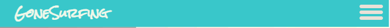

# GoneSurfing
The site can be accessed through this [link](https://robinf98.github.io/gone-surfing/)
## User Stories

### First Time User Goals
* As a First Time User, I want to learn more about surfing, so that I can get more involved in the activity.
* As a First Time User, I want to understand the purpose of the site, so that I can use it more effectively.
* As a First Time User, I want to get tips on how to get started with surfing.
* As a First Time User, I want to be find contact details for the GoneSurfing team, so that I can ask questions and get involved.
### Returning User Goals
* As a Returning User, I want to be able to find out where the GoneSurfing team meet and surf, so that I can join them.
* As a Returning User, I want to see pictures of the GoneSurfing team surfing, so that I can get a better feel for the team ethos.

### Frequent User Goals
* As a Frequent User, I want to recieve regular updates on the GoneSurfing community, so that I can stay informed and incorporate surfing further into my lifestyle.
* As a Frequent User, I want to use GoneSurfing as my primary source of surfing news.
* As a Frequent User, I want to see updated pictures of GoneSurfing Meetups, so that I can see myself surfing.

## Features

* ### Navbar
    * Positioned at page top.
    * Logo on left side.
    * Navigation links on right side.
        * HOME - links to home page where users can see an overview of the GoneSurfing site.
        * BLOG - links to the blog page where users can read articles and learn more about surfing.
        * GALLERY - links to gallery page where users can see pictures of community members surfing.
        * CONTACT - links to contact page where users can join a mailing list and get in touch.
    * All links have a hover effect animation.

    * The navbar is responsive:
        * On smaller screens (<800px wide), the navbar is replaced by a hamburger menu with a sidebar for navigation.

            * When the hamburger meunu is clicked, the sidebar with navigation links pops out.
            * These links have hover effect animations.

---
* ### Home Page
    * Provides:
        * An overview of what GoneSurfing is
        * Featured blog posts to read through.
        * Google maps section showing location of meetups

* #### Hero Section
    * Large background image
    * Welcome message to users

* #### Featured Blog Section
    * Shows featured blog posts
    * Posts have hover effect animation

* #### Footer
    * Contains Google maps iframe displaying meetup locations
    * Contains social media links that open in a new tab
    * Links have hover animation

## Wireframes

### Desktop screen size

[Desktop - Home](documentation/home.png)

[Desktop - Blog](documentation/blog.png)

[Desktop - Gallery](documentation/gallery.png)

[Desktop - Contact](documentation/contact.png)

### Mobile screen size

[Mobile - Home](documentation/home_mobile.png)

[Mobile - Blog](documentation/blog_mobile.png)

[Mobile - Gallery](documentation/gallery_mobile.png)

[Mobile - Contact](documentation/contact_mobile.png)

## BUGS

* Hover effect fro blog post doesent eork in firefox