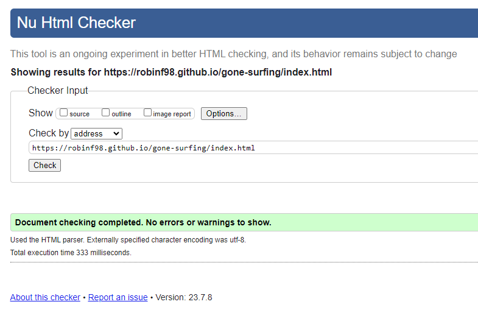
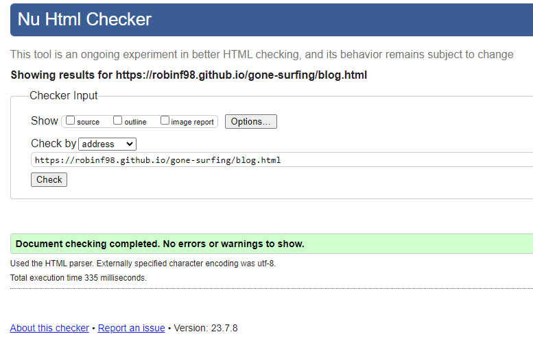
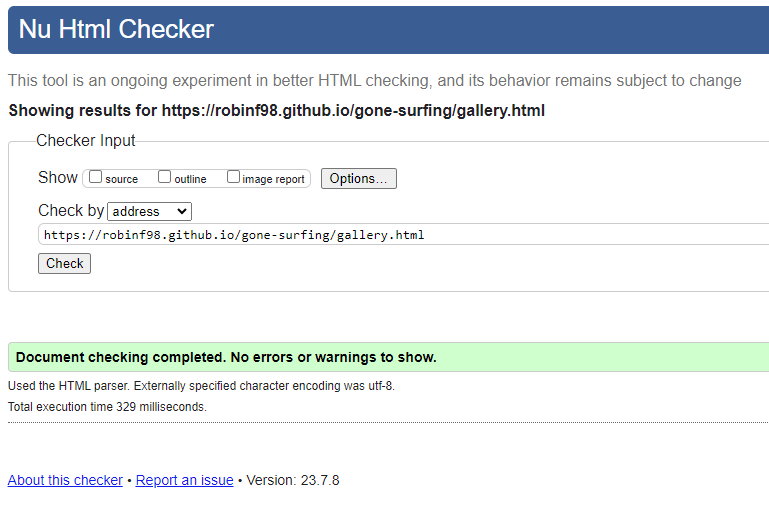
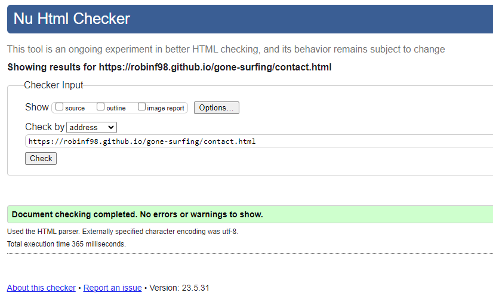
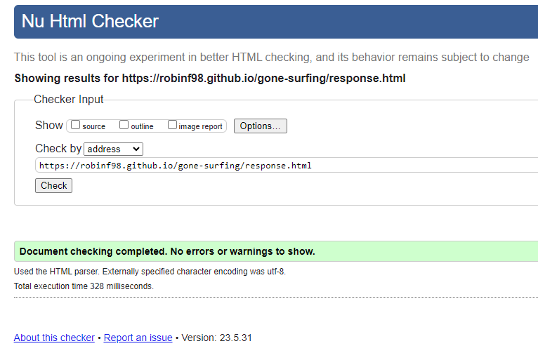
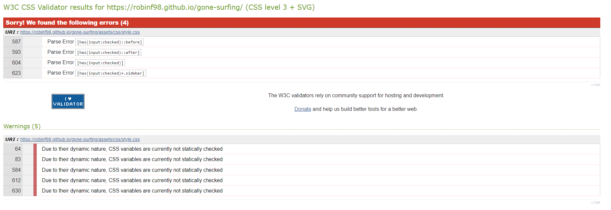
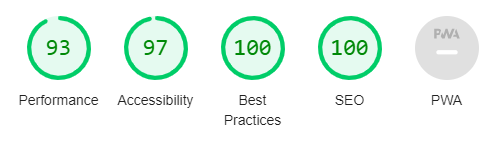
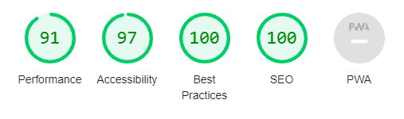
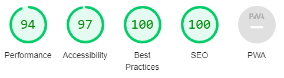

# TESTING

## Compatibility

---

The site was tested on 3 browsers: Chrome, Edge, and Opera
All features work as expected on these browsers.

* ### Chrome

  * [Chrome Home](documentation/home.png)
  * [Chrome Blog](documentation/blog.png)
  * [Chrome Gallery](documentation/gallery.png)
  * [Chrome Contact](documentation/contact.png)

* ### Edge

  * [Edge Home](documentation/edge_home.jpeg)
  * [Edge Blog](documentation/edge_blog.jpeg)
  * [Edge Gallery](documentation/edge_gallery.jpeg)
  * [Edge Contact](documentation/edge_contact.jpeg)

* ### Opera

  * [Opera Home](documentation/opera_home.png)
  * [Opera Blog](documentation/opera_blog.png)
  * [Opera Gallery](documentation/opera_gallery.png)
  * [Opera Contact](documentation/opera_contact.png)

## Responsiveness

---

Responsiveness was tested with [Responsive Design Checker](https://responsivedesignchecker.com/)
On the browsers tested, the responsiveness works as expected on all standard screen sizes.

## Manual Testing

---

| Feature | Action | Expected Result | Tested | Passed | Comments |
| --- | --- | --- | --- | --- | --- |
| Navbar | | | | | |
| Home | Click on "Home" link | User is redirected to home page | Yes | Yes | - |
| Blog | Click on "Blog" link | User is redirected to blog page | Yes | Yes | - |
| Gallery | Click on "Gallery" link | User is redirected to gallery page | Yes | Yes | - |
| Contact | Click on "Contact" link | User is redirected to contact page | Yes | Yes | - |
| Footer | | | | | |
| YouTube icon | Click on YouTube icon | User is redirected to YouTube page | Yes | Yes | - |
| Facebook icon | Click on Facebook icon | User is redirected to Facebook page | Yes | Yes | - |
| Twitter icon | Click on Twitter icon | User is redirected to Twitter page | Yes | Yes | - |
| Instagram icon | Click on Instagram icon | User is redirected to Instagram page | Yes | Yes | - |
| Home page | | | | | |
| Blog Posts | Hover over a blog post | The background image opacity is set to 1.00 | Yes | Yes | - |
| Blog page | | | | | |
| Blog Posts in Featured Section | Hover over a blog post | The background image opacity is set to 1.00 | Yes | Yes | - |
| Blog posts in Blog list | Hover over blog listing | Blog listing is highlighted | Yes | Yes | - |
| "Contact Us" link in Blog list section| Click on "Contact Us" link | User is redirected to contact page | Yes | Yes | - |
| Gallery page | | | | | |
| Image in Gallery | Hover over image | Image zooms in | Yes | Yes | - |
| Contact page | | | | | |
| First Name input | Enter user first name | User first name entered | Yes | Yes | If input is left blank, error message appears on submit |
| Last Name input | Enter user the last name | User last name entered | Yes | Yes | If input is left blank, error message appears on submit |
| Email input | Enter user email | User email entered | Yes | Yes | If input is left blank, error message appears on submit. If email is invalid, error message appears on submit |
| All news / Some news radio | Select an option | Option selected | Yes | Yes | If no option is selected, error message appears on submit |
| Submit button | Click on Submit button | User is redirected to response page | Yes | Yes | - |
| Response page | | | | | |
| Response message | Automatically redirected to home page after 10 seconds | Redirected to home page | Yes | Yes | - |
| "Back to home" button | Click on "Back to home" button | User is redirected to home page | Yes | Yes | - |
| Smaller screens | | | | | |
| Hamburger Menu | Click on hamburger menu | Sidebar appears | Yes | Yes | - |

## Validator Testing

---

### HTML

* Home Page

  * No errors or warnings were found by the W3C validator
    

* Blog Page

  * No errors or warnings were found by the W3C validator
    

* Gallery Page

  * No errors or warnings were found by the W3C validator
    

* Contact Page

  * No errors or warnings were found by the W3C validator
    

* Response Page

  * No errors or warnings were found by the W3C validator
    

### CSS

    * Some errors were found by the [Jigsaw Validator](https://jigsaw.w3.org/css-validator/), but the parsing errors found work correctly in the browsers tested, and are valid CSS selectors. The warnings on the CSS variables are expected and not an issue.

## Lighthouse Report

---

The lighthouse reports from Chrome devtools show the site performs well, is accessible, and conforms to best practises and SEO

### Home Page

### Blog Page

### Gallery Page

### Contact Page

## Bugs

---

* Hamburger menu does not work in Firefox browser - Firefox does not currently support the CSS :has() pseudo-class, although steps are being taken to amend this: [link](https://developer.mozilla.org/en-US/docs/Web/CSS/:has)
